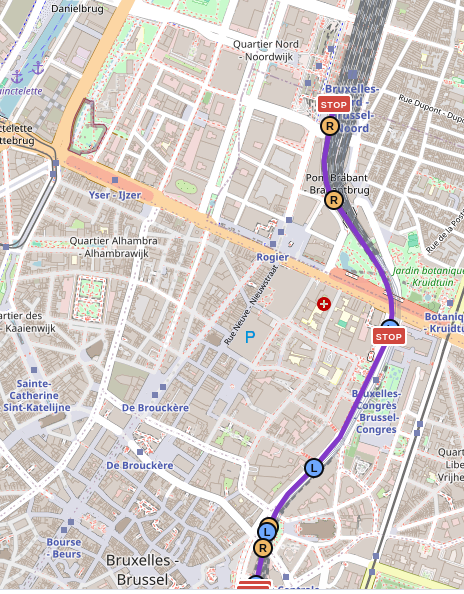

# Locating a train without GPS 🚂

_

*by Team 2*
*Aaron Hallaert*
*Sam Jaques*

---

## The problem

- Sensors: accel + gyro, patchy cell, thin wifi
- No GPS. That's the challenge 🎯
- Allowed: GTFS timetable, OSM map, cell tower CSV
- Output: full trajectory + station calls

---

## Approach: three lanes

```
IMU (accel, gyro)  ──▶  motion lane  ──▶  shape.json    ──┐
                                                            ├──▶  hydration ──▶  fusion
cell, wifi, GTFS   ──▶  absolute lane ──▶  anchors.json ──┘
```

- **Motion**: route *shape*: turns, no position
- **Absolute**: rough position *anchors* + route candidates
- **Hydration**: fits the shape onto the map using the anchors
- Two engineers, two lanes, worked in parallel

---

## Motion lane 🔄

- Turns: cheap and accurate (median error 10°)
- Speed from accelerometer: fails outright ❌
- Speed from curve geometry: works ✅
- Lesson: trust the shape, not the scale

---

## Absolute lane 📡

- GTFS: guesses the right route **~94%** of the time
- Cell towers: noisy, but enough for rough anchors
- OSM map: stitched into one connected network
- Stations matched across language name mismatches

---

## Hydration 🧩

- Fits the shape onto the map, fast (~1s per leg)
- Combines all clues on one common scale
- Cross-checks the result against the timetable
- Also works live, streaming as data arrives

---

## Results (practice set) 📊

| Metric                | Score       |
| --------------------- | ----------- |
| Route correct         | **48 / 50** |
| Station calls correct | 42 / 50     |
| Position error        | **310 m**   |

- Biggest wins: turn-fitting, capped priors, timetable check

---

## Cold start & wrap-up ❄️

- Cold start: guess the origin station first
- Fixed on 12/50 legs
- Lesson: no single sensor is enough
  - fusing weak clues under one model wins
